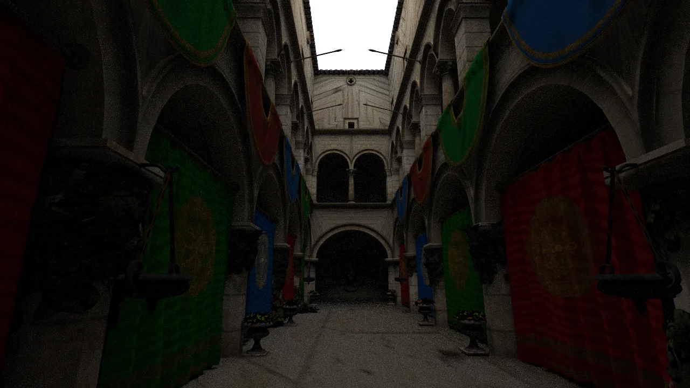

# pathtracer-webgl

A GPU path tracer that runs entirely in the browser. The scene layer is built on three.js; the
**path-tracing core is written from scratch** — BVH build and GPU traversal, direct light sampling,
materials, and progressive accumulation, all in WebGL2 + GLSL ES 3.00.

**Live demo**: <https://hydrocylic.github.io/pathtracer-webgl/>　**Source**: <https://github.com/Hydrocylic/pathtracer-webgl>

> 中文摘要：浏览器内的 **WebGL2 路径追踪渲染器**。场景管理层用 three.js，渲染内核自研（BVH 构建与 GPU 遍历、
> 直接光采样、材质、渐进累积）。本仓根目录是内核（JS）与旧入口，**`web/` 是 TypeScript + React 展示层**。



## Features

- Interactive path tracing of a **262,267-triangle** Sponza atrium, with per-pixel progressive accumulation
- **Hand-written BVH** build (median split) and GPU traversal — no third-party ray-tracing library
- **Next-event estimation** for analytic quad lights; Lambert / mirror / glass materials
- Debug views: normals / albedo / hit distance / escape / traversal steps
- **TypeScript + React shell** (`web/`) driving the JS core through a typed, narrow interface (zh/en UI)

## Quick start

```bash
# core + legacy entry (repository root)
npm install
npm run dev          # http://localhost:5173
npm run build

# TypeScript + React shell
cd web
npm install
npm run dev          # http://localhost:5174
npm run build        # -> web/dist
```

Requirements: Node ≥ 20 and a browser with **WebGL2**.

## Architecture

| Path | Responsibility |
|---|---|
| `src/renderer/bvh.js` | BVH build (median split) + packing into GPU textures |
| `src/shaders/pathtrace.frag.glsl` | Path tracing core: BVH traversal, NEE, materials, accumulation |
| `src/shaders/composite.frag.glsl` | Display pass (gamma) |
| `src/scene.js`, `src/scene/` | Scene definitions + glTF materialization |
| `src/main.js` | Legacy entry: render loop, bundles, uniform upload, Tweakpane panels |
| `web/` | TypeScript + React shell: scene / parameter / debug / camera / status / environment panels |
| `public/` | Sponza + sample glTF assets |

Data flow: scene config → glTF materialization → BVH + attribute textures → `pathtrace` fragment
shader → ping-pong accumulation → display pass.

## Key decisions

1. **Shell and core are separate** — the render core stays plain JS with `.d.ts` types; the shell is
   TypeScript + React. Rewriting the shell does not touch the core, and image equality can be checked
   numerically instead of by eye.
2. **TDR handled by a load-shedding combo** — tracing 262k triangles per pixel tripped the GPU watchdog
   (TDR); mitigated by `textureLod` sampling + **2×2 tiled rendering** + a **66 ms frame cap**.
3. **Observable and reproducible** — GPU texture read-back probes; local headless capture with PSNR
   comparison; "converged" defined as a measurable number ($S^{*}$).

## Performance (measured; conditions included)

| Metric | Value | Conditions |
|---|---|---|
| Scene size | 262,267 triangles | Khronos Sponza, deduplicated index triples |
| BVH size / depth | 162,853 nodes / depth 29 | same machine & scene; **differs from an earlier record — to be checked** |
| BVH build time | 1,299 ms | build section only (excl. file read / parse / upload) — **to be checked** |
| Effective sample throughput $R_S$ | 3.56–3.73 samples/s | single RTX 3060 Ti × 720p (3.56) / 1080p (3.73); **no standalone fps** (frame rate is capped) |
| Samples to converge $S^{*}$ | ≤ 16 per pixel | $\mathrm{PSNR}(I_S, I_{512}) \ge 35$ dB; self-consistency 49.46 / 46.42 dB |
| Tree cost | 0.445× (≈55% lower) | **spheres dataset**; baseline = pure median split; normalized SAH cost |

> Image/throughput figures were measured on 2026-09-17/18; the scene lighting was adjusted afterwards
> and **not re-measured**.

## Assets & licenses

- **Sponza Atrium** — Frank Meinl (Crytek), distributed via Khronos glTF-Sample-Models, **CC BY 3.0**
  (attribution required) — see `THIRD-PARTY.md`
- Sample glTF models — see `THIRD-PARTY.md`
- three.js / React / Vite and other dependencies — see `THIRD-PARTY.md`

## License

MIT — see `LICENSE`.
